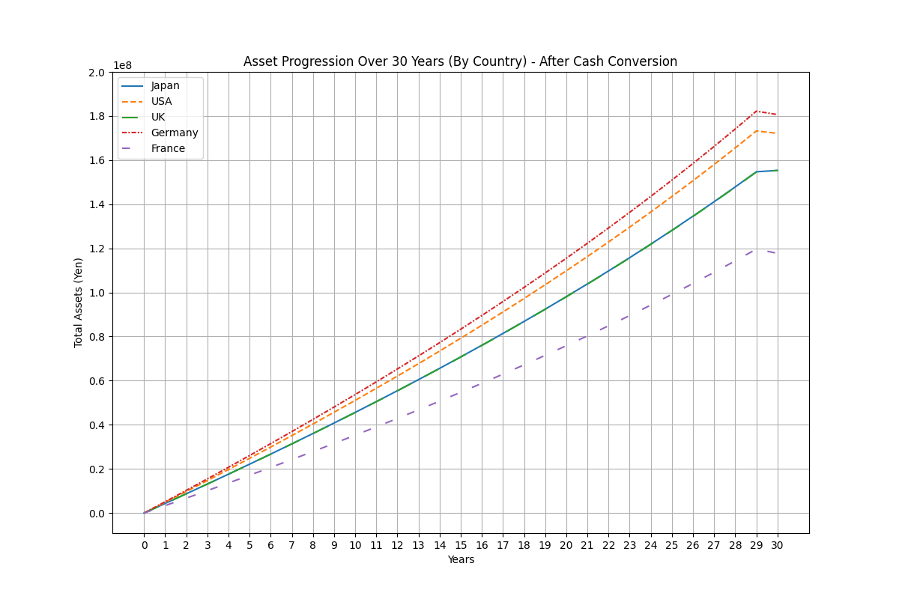

# Asset Formation Simulation Script

This README explains a Python script designed to simulate asset formation over a period of years in various countries.  
**Please note that the results are simulations based on current data and assumptions and should not be construed as financial advice or a guarantee of specific outcomes.**


## Requirements

Ensure you have the following installed:
- Python 3.x
- NumPy
- Matplotlib

You can also install these libraries using pip:
```bash
pip install numpy matplotlib
```

## Script Premises

1. **Investment Duration:**
   - The script considers a fixed number of years (defined as `years(=30)`) for asset accumulation and investment.

2. **Salary and Taxation:**
   - Calculates the net salary in each country after applying the effective tax rate.
   - Uses country-specific data for salary and tax rates.

3. **Cost of Living Adjustments:**
   - Adjusts the remaining income after considering the cost of living index for each country.

4. **Investment Strategy:**
   - A portion of the remaining income (defined by `investment_rate(=0.20)`) is invested annually.
   - The investment grows at a specified annual return rate (`annual_return(=0.05)`).

5. **Capital Gains Tax:**
   - Considers the impact of capital gains tax in each country when the investment is liquidated at the end of the investment period.

6. **Comparison Across Countries:**
   - Compares asset formation in Japan, USA, UK, Germany, and France using specific financial data for each country.
   - The script uses a base cost of living index (from Japan) to make a relative comparison.


## Running the Asset Formation Simulation

To successfully run the asset formation simulation, follow these detailed steps:

1. **Obtain the Script:**
   - If available on a platform like GitHub, use Git to clone the repository:
     ```bash
     git clone [repository-url]
     ```
   - Alternatively, download the script file directly from the source.

2. **Set Up Your Python Environment:**
   - Confirm that Python 3.x is installed:
     ```bash
     python --version
     ```
   - Install NumPy and Matplotlib if they're not already installed:
     ```bash
     pip install numpy matplotlib
     ```

3. **Navigate to the Script Directory:**
   - Use the command line to navigate to the directory containing the script:
     ```bash
     cd path/to/script
     ```

4. **Modify Parameters (Optional):**
   - Open the script in a text editor or IDE.
   - Adjust parameters such as `years`, `investment_rate`, `annual_return`, etc., to fit your simulation needs.

5. **Execute the Script:**
   - Run the script through your Python interpreter:
     ```bash
     python asset_simulator.py
     ```
   - This will start the calculation process and generate the asset formation plot.

6. **Review the Output:**
   - The script will create a graph of progression of assets over the specified years for each country and save it as png file under the same director of the script file.

## Result



## Data
### Salaries

Google Software Engineer / Any Experience (Total Pay Average) as of 2023-12-12:

- Japan: **JP¥12,595,032**
- USA: **US$251,215 (= ¥35,672,530) $1 = 142¥**
- UK: **£100,310 (=¥16,852,080) £1 = 168¥**
- Germany: **€106,179 (=¥15,395,955) €1 = 145¥**
- France: **€76,256 (=¥11,057,120) €1 = 145¥**

[Google Software Engineer Salaries from glassdoor](https://www.glassdoor.co.uk/Salary/Google-Software-Engineer-Salaries-E9079_D_KO7,24.htm?selectedLocationString=N,226&filter.jobTitleExact=Software+Engineer&employerId=9079&experienceLevel=)

### **Effective Tax Rate on Personal Income against the above salary**: For a married couple with two children, as of January 2023

- Japan: 13.9%
- USA: 20.0%
- UK: 28.3%
- Germany: 11.9%
- France: 12.4%

[Effective tax Rate on Personal Income from Japan Ministry](https://www.mof.go.jp/tax_policy/summary/income/028a.pdf)

### Cost of Living Plus Rent Index 2023 by NUMBEO

- (New York: 100)
- Japan: 43.6
- USA: 60.3
- UK: 46.6
- Germany: 45.3
- France: 47.5

[Cost of Living Index by Country 2023](https://www.numbeo.com/cost-of-living/rankings_by_country.jsp?title=2023)

### Taxation on Capital Gains from Stocks

- Japan: 20.3%
- USA: 15% + [California State Tax](https://www.tax-brackets.org/californiataxtable) 10.3% + San Francisco City Tax 0% = 25.3%
- UK: 20%
- Germany: 26.4%
- France: 30% (If opting for separate declaration)

[Japan Ministry of Finance on Capital Gains Tax](https://www.mof.go.jp/tax_policy/summary/income/kabu04.pdf)
